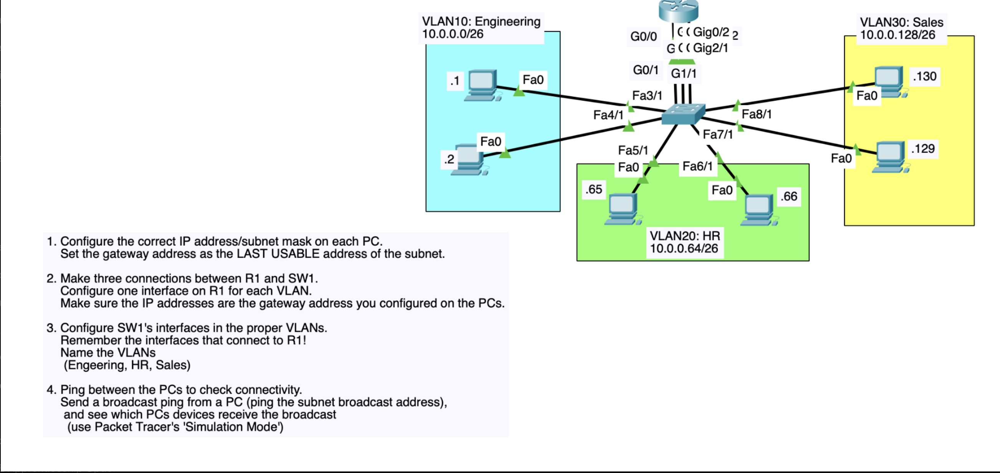

# Port-by-Port Connection Map

## SW1 access ports → end devices

| SW1 Port | Connected to | VLAN |
|----------|---------------|------|
| Fa3/1 | Eng-PC1 (.1)  | 10 |
| Fa4/1 | Eng-PC2 (.2)  | 10 |
| Fa5/1 | HR-PC1 (.65)  | 20 |
| Fa6/1 | HR-PC2 (.66)  | 20 |
| Fa7/1 | Sales-PC1 (.130) | 30 |
| Fa8/1 | Sales-PC2 (.129) | 30 |

## SW1 access ports → R1 (three separate links, one per VLAN — no trunk)

| SW1 Port | R1 Port | VLAN |
|----------|---------|------|
| Fa1/1 | G0/0   | 10 |
| Fa2/1 | G0/1   | 20 |
| G1/1  | Gig0/2 | 30 |

> If your actual Packet Tracer port numbers differ, just swap the numbers in
> `configs/R1-config.txt` and `configs/SW1-config.txt` — the VLAN-to-subnet logic stays the same.

## Why no trunk / router-on-a-stick?

The assignment explicitly asks for **three physical connections** between R1 and SW1, with
**one R1 interface per VLAN** carrying that VLAN's gateway IP directly. This is "multiple
router links" routing rather than the classic single-trunk-link router-on-a-stick design —
simpler to configure, but it uses 3 physical interfaces/ports on each side instead of 1.
